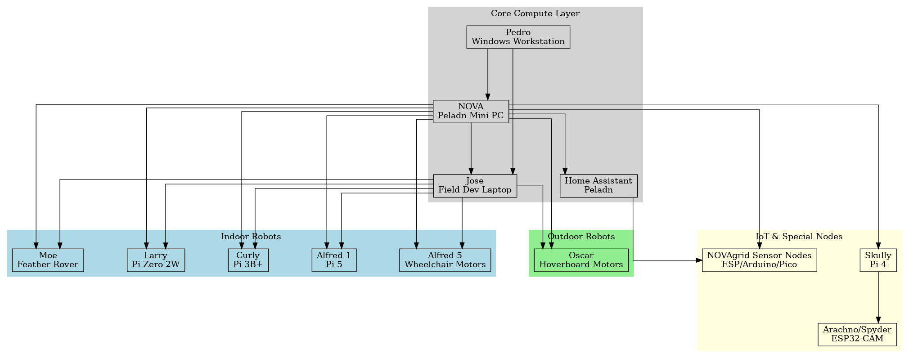

# 🌐 NOVAgrid  
### Unified Robotics & Automation Ecosystem for AstroGear Labs

NOVAgrid is the master architecture that links together all robots, dev machines, IoT devices, sensors, and automation nodes within the AstroGear Labs environment.  
It provides a cohesive, expandable framework for:

- Mobile robots (indoor & outdoor)
- Distributed sensor networks
- Home automation integration
- Voice-interactive systems
- Development & operations tools
- Future multi-robot coordination

NOVAgrid ties everything into one intelligent, organized system.

---

# 🧠 Core Compute Layer

The central control systems that coordinate all robots and devices.

### **NOVA – Central AI Hub**
- Peladn Mini PC + 32" display  
- Ubuntu + ROS 2 Jazzy  
- Runs mapping, planning, fleet coordination  
- Piper TTS + future ASR  
- Interfaces with Home Assistant  
- Primary command center

### **Pedro – Main Development Workstation**
- Windows desktop  
- CAD (Fusion 360), KiCad, documentation, GitHub  
- No ROS2 — used for engineering, design, video, and documentation

### **Jose – Field Development Laptop**
- Dell laptop, Ubuntu + ROS 2 Jazzy  
- Mobile debugging, firmware flashing, rviz2 sessions, on-site ROS2 work

### **Home Assistant – Automation Layer**
- Bare-metal Peladn machine  
- Connects sensors (Zigbee, Wi-Fi, etc.)
- Provides environment data for robots  
- Handles home automations & notifications

---

# 🤖 Mobile Robotics Layer

## 🏠 Indoor Robots

### **Alfred 1**
- Raspberry Pi 5 + SSD  
- JGA25-371 motors with encoders  
- TB6612FNG motor driver  
- LIDAR, camera  
- Primary learning & development robot

### **Alfred 5 – Indoor Butler Robot**
- Raspberry Pi 5 + SSD  
- Wheelchair motors + IBT-2 motor drivers  
- LIDAR, camera, indoor navigation  
- Future manipulator (arm)  
- Flagship AstroGear Labs robot

### **Moe – Mini Rover**
- Adafruit Feather + RC chassis  
- Simple rover for sensor tests & demos

### **Larry – Rover 1**
- Pi Zero 2 W  
- micro-ROS / ROS 2 Lite  
- Lightweight mapping & experiments

### **Curly – Rover 2**
- Raspberry Pi 3B+  
- ROS 2 Humble  
- Mid-range rover for navigation tests

---

## 🌲 Outdoor Robot

### **Oscar – Zero-Turn Lawn Rover**
- Raspberry Pi 5  
- Hoverboard motors (BLDC)  
- VESC/BLDC drivers  
- LIDAR + planned GPS integration  
- Autonomous mowing, outdoor navigation

---

# 🕸️ NOVAgrid IoT Layer (Nodes & Special Units)

### **Skully – Animatronic Skull**
- Raspberry Pi 4  
- Rhasspy + Piper  
- Voice interaction + animatronics

### **Arachno / Spyder – Camera Node**
- ESP32-CAM / M5Stack  
- Face detection & video streaming  
- Sends events to Skully & NOVA

### **Sensor Nodes**
- ESP32, ESP01, Raspberry Pi Pico, Arduino  
- Door sensors, weather nodes, automation triggers  
- Power monitoring, environmental sensing  
- Provide real-time data to HA + NOVA

---

# 📐 System Architecture Diagram

---

# 📁 Repository Structure

  NOVAgrid/
│
├── README.md
├── diagrams/
│ └── NOVAgrid_Architecture_Wide_Orthogonal.png
│
└── docs/
├── NOVAgrid_Architecture.md
├── NOVAgrid_Master_Document.md
├── Robots/
│ ├── Alfred1.md
│ ├── Alfred5.md
│ ├── Oscar.md
│ ├── Moe.md
│ ├── Larry.md
│ └── Curly.md
├── Nodes/
│ ├── Skully.md
│ ├── Spyder.md
│ └── SensorNodes.md
└── HomeAssistant/
├── IntegrationNotes.md
├── Automations.md

---

# 🚀 Goals of NOVAgrid

- Build a unified robotics ecosystem  
- Standardize communication between robots, nodes, and HA  
- Enable multi-robot coordination  
- Provide long-term structure for Alfred 1 → Alfred 5 evolution  
- Bridge home automation with robotics  
- Serve as the backbone for AstroGear Labs

---

# 🛠 Future Work

- ROS 2 topic & service maps for each robot  
- Multi-robot behavior tree layer  
- Alfred 5 manipulation subsystem  
- Oscar mowing safety systems  
- Localization beacons via NOVAgrid nodes  
- Integration of Home Assistant sensor streams into ROS

---

# © AstroGear Labs  
Created and maintained by **Eric (AstroGear Labs / ET Robotics & AI)**.
